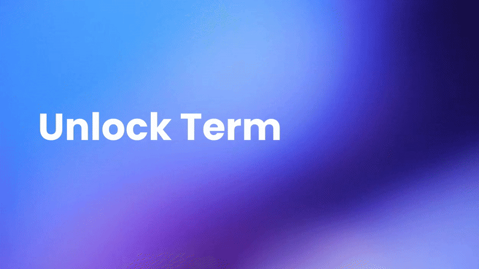

# Termino: Type less. Do more.

Tired of typing `npm run build`, `git status`, and `docker compose up` all day?. What if you could run your most-used terminal commands with a **single keystroke**, right inside VS Code?

Welcome to **Termino**.

Termino is a simple, powerful VS Code extension that maps your favorite commands to single keys. It's designed to get out of your way and let you focus on what matters. Stop typing, start launching.


## Why You'll Love Termino

Termino was built to eliminate the small, repetitive tasks that drain your energy and break your flow. Here's how it will make your coding life better:

  - ** Work at the Speed of Thought:** Imagine pressing `b` to build, `t` to test, and `d` to deploy. Termino turns common commands into muscle memory, keeping you in the zone.

  - ** Reclaim Your Brainpower:** Your mind is for solving complex problems, not for remembering command-line flags. With Termino, your commands are always a keypress away.

  - ** Instant Action, Zero Friction:** Run scripts, check status, or manage services without ever fumbling with the terminal. Hit your key, and it's done.

  - ** 100% Your Workflow:** Termino is unopinionated. You define the shortcuts. Whether you're a frontend guru, a backend master, or a DevOps champion, you can tailor it to fit your unique process perfectly.


## Installation

Getting started is as easy as installing any other extension.


1.  Open **Visual Studio Code**.
2.  Go to the **Extensions** view (`Ctrl+Shift+X` or `Cmd+Shift+X`).
3.  Search for `Termino`.
4.  Click **Install**.
5.  Reload VS Code if prompted. That's it\!


##  How It Works

Termino gives you several clean and simple ways to fire off your commands.

###  The Interactive Launcher (The Magic\!)

The Launcher is the heart of Termino. It's a dedicated panel that listens for your shortcuts.

1.  Open the **Termino Launcher** from the VS Code Activity Bar.
2.  Simply press a key you've configured (like `g`, `b`, `s`).
3.  Termino instantly runs the command in your terminal. You'll see the key flash on screen to confirm\!

The Launcher has two special keys built-in:

  * **Press `H` for Help:** Instantly opens your **Termino Cookbook**, a handy table of all your shortcuts.
  * **Press `Q` for Quick Pick:** Opens a searchable list of all your commands for when you don't remember the key.

###  Quick Launch from the Command Palette

If you live in the Command Palette, we've got you covered.

1.  Press `Ctrl+Shift+P` (or `Cmd+Shift+P` on Mac).
2.  Type `Termino: Quick Launch`.
3.  A searchable list of your shortcuts will appear. Select one and press Enter to run it.


###  Effortless Shortcut Setup

Setting up your personal command shortcuts is a breeze.


1.  **Open Your Shortcut File:**

      * Press `Ctrl+Shift+P` / `Cmd+Shift+P`.
      * Type `Termino: Edit Shortcuts`.
      * This will create and/or open a `.vscode/termino-shortcuts.json` file in your project's root directory.

2.  **Add Your Commands:**

      * Inside this JSON file, define your shortcuts. Each shortcut needs a `key` (the letter you'll press), a `cmd` (the command to run), and an optional `desc` (a description for the Cookbook and Quick Pick).

    <!-- end list -->

    ```json
    {
      "g": {
        "cmd": "git status --short",
        "desc": "See quick git status"
      },
      "b": {
        "cmd": "npm run build",
        "desc": "Build the project"
      },
      "s": {
        "cmd": "npm start",
        "desc": "Start the development server"
      },
      "d": {
        "cmd": "docker compose up -d",
        "desc": "Start Docker containers"
      }
    }
    ```

3.  **Reload & Go\!**

      * Save the `termino-shortcuts.json` file.
      * Press `Ctrl+Shift+P` / `Cmd+Shift+P` and run `Termino: Reload Shortcuts`.
      * Your new commands are now live in the Launcher and Quick Launch\!


###  Advanced: Custom Shortcut File Path

By default, Termino looks for `.vscode/termino-shortcuts.json`. If you want to use a global shortcut file or place it somewhere else in your project (e.g., in a monorepo), you can easily change the path.

1.  Go to VS Code Settings (`Ctrl+,` or `Cmd+,`).
2.  Search for "Termino".
3.  Find the `Termino: Shortcuts Path` setting and update it with your desired file path (e.g., `/Users/you/global-shortcuts.json` or `${workspaceFolder}/config/my-shortcuts.json`).


## The Cookbook: Your Command Cheat Sheet

Forgot which key does what? The Cookbook is your best friend. It provides a clean, up-to-date table of all your configured shortcuts.

Access it in two ways:

  * Press **`H`** in the Termino Launcher.
  * Run **`Termino: Show Cookbook`** from the Command Palette (`Ctrl+Shift+P`).


## Conclusion

Termino is more than just a utility; it's a way to build a faster, more fluid relationship with your most-used tools. It removes the tedious typing that stands between an idea and its execution.

**Unleash your terminal. Unleash your flow. Try Termino and code at the speed of thought\!**





## Feedback & Contributions

I built Termino to make my life easier, and I hope it makes yours easier too. Termino is now a baby so it can make mistakes your feedback is invaluable for making it even better. If you encounter a bug, have a feature idea, or just want to share how you're using it, please don't hesitate to reach out\!

You can **[open an issue on our GitHub repository](https://www.google.com/search?q=https://github.com/termino/issues)**. Let's build a faster workflow together\!